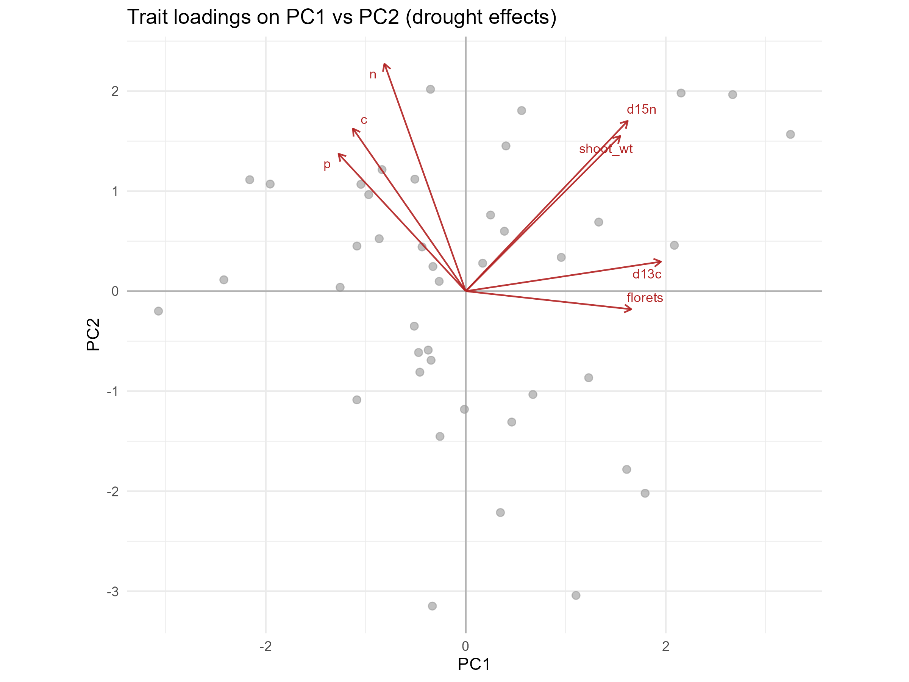
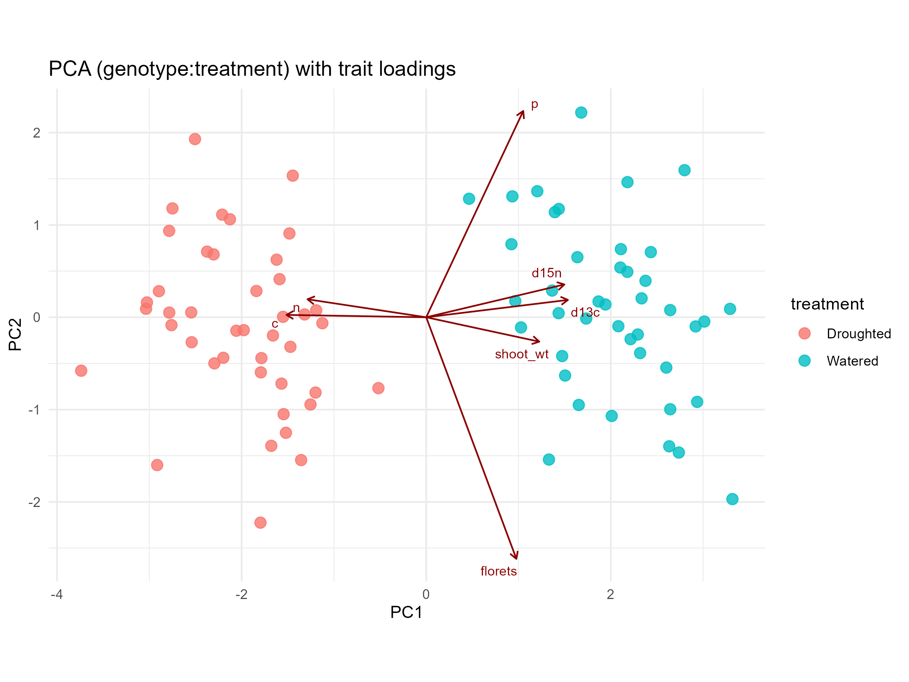
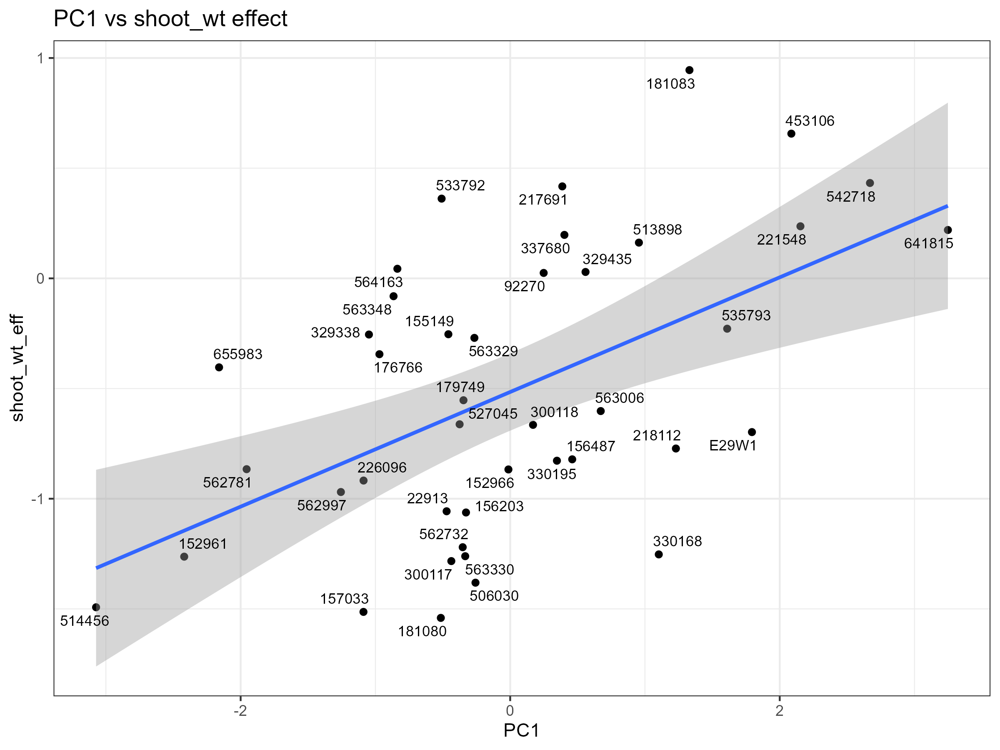
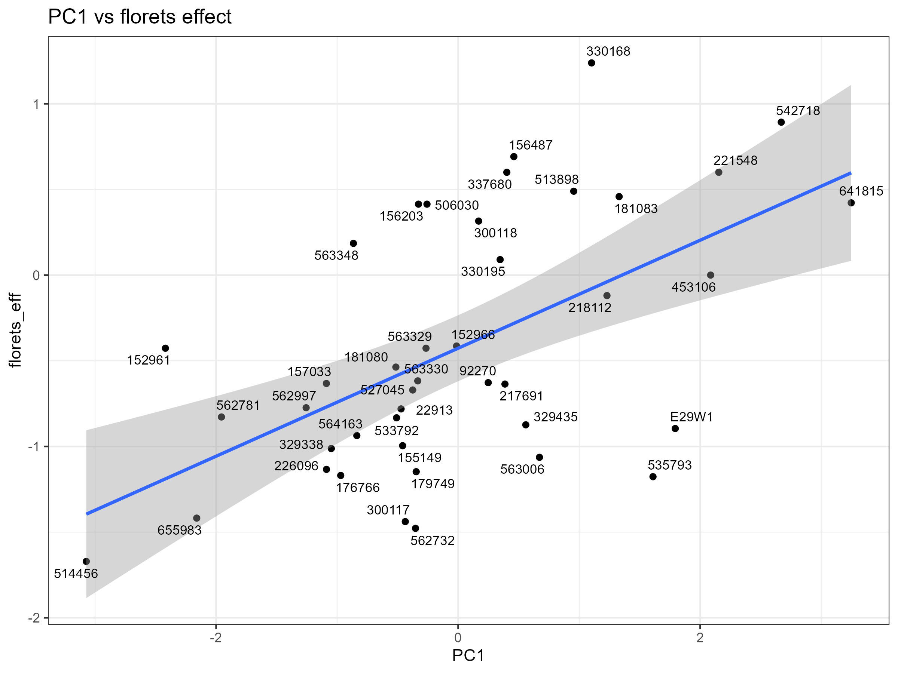

# MAC-2022-Drought: Figures and numeric summaries

Generated: 2025-08-15

## Figures

### 1) Drought response heatmap


### 2) PCA scree plot


### 3) PCA trait loadings (biplot)


### 4) PCA trait loadings colored by sensitivity


### 5) PCA genotype:treatment by treatment


### 6) PCA genotype:treatment biplot


### 7) PCA vs Shoot weight effect


### 8) PCA vs Florets effect


## Numeric summaries

- Number of significant genotype x trait t-tests (p < 0.05): **75**

### Top 10 absolute effects (genotype, variable, effect)

```
# A tibble: 10 × 3
```
```
   genotype variable effect
```
```
   <chr>    <chr>     <dbl>
```
```
 1 533792   c          1.85
```
```
 2 226096   c          1.82
```
```
 3 655983   c          1.77
```
```
 4 176766   c          1.76
```
```
 5 562732   c          1.76
```
```
 6 152961   d13c      -1.76
```
```
 7 176766   d13c      -1.74
```
```
 8 562781   n          1.72
```
```
 9 514456   d13c      -1.70
```
```
10 527045   d13c      -1.70
```

### PCA variance explained (first 6 PCs)

```
  PC VarPct CumPct
```
```
1  1   25.3   25.3
```
```
2  2   24.7   50.0
```
```
3  3   15.9   65.9
```
```
4  4   12.4   78.3
```
```
5  5    9.2   87.5
```
```
6  6    7.4   94.9
```

### Shoot weight model: shoot_wt_eff ~ PC1 + PC2

```

```
```
Call:
```
```
lm(formula = shoot_wt_eff ~ PC1 + PC2, data = scores_perf)
```
```

```
```
Residuals:
```
```
    Min      1Q  Median      3Q     Max 
```
```
-1.1399 -0.2591 -0.0560  0.2860  0.9344 
```
```

```
```
Coefficients:
```
```
            Estimate Std. Error t value Pr(>|t|)    
```
```
(Intercept) -0.51567    0.06912  -7.460 5.04e-09 ***
```
```
PC1          0.26016    0.05261   4.945 1.49e-05 ***
```
```
PC2          0.26120    0.05317   4.913 1.65e-05 ***
```
```
---
```
```
Signif. codes:  0 '***' 0.001 '**' 0.01 '*' 0.05 '.' 0.1 ' ' 1
```
```

```
```
Residual standard error: 0.448 on 39 degrees of freedom
```
```
Multiple R-squared:  0.5547,	Adjusted R-squared:  0.5319 
```
```
F-statistic: 24.29 on 2 and 39 DF,  p-value: 1.406e-07
```
```

```

### Florets model: florets_eff ~ PC1 + PC2

```

```
```
Call:
```
```
lm(formula = florets_eff ~ PC1 + PC2, data = scores_perf)
```
```

```
```
Residuals:
```
```
    Min      1Q  Median      3Q     Max 
```
```
-1.3187 -0.3035 -0.1335  0.4711  1.2130 
```
```

```
```
Coefficients:
```
```
            Estimate Std. Error t value Pr(>|t|)    
```
```
(Intercept) -0.42678    0.09622  -4.436 7.29e-05 ***
```
```
PC1          0.31519    0.07324   4.304 0.000109 ***
```
```
PC2         -0.03443    0.07401  -0.465 0.644363    
```
```
---
```
```
Signif. codes:  0 '***' 0.001 '**' 0.01 '*' 0.05 '.' 0.1 ' ' 1
```
```

```
```
Residual standard error: 0.6236 on 39 degrees of freedom
```
```
Multiple R-squared:  0.3245,	Adjusted R-squared:  0.2899 
```
```
F-statistic: 9.369 on 2 and 39 DF,  p-value: 0.0004757
```
```

```

<!-- AUTO-REPORT-START -->

# Auto-generated: Figures and numeric summaries

Generated: 2025-08-15

## Figures (auto-inserted)

### 1) Drought response heatmap


Interpretation: This heatmap shows standardized differences (Drought - Watered) per genotype and trait; red = increase, blue = decrease. Stars mark nominal t-test significance.

### 2) PCA scree plot


Interpretation: The scree plot shows variance explained by each PC; PC1/PC2 often capture the major response syndromes.

### 3) PCA trait loadings (biplot)


Interpretation: Arrows indicate trait contributions to PC axes; similar directions = correlated drought responses.

### 4) PCA trait loadings colored by sensitivity


Interpretation: Genotypes colored by mean effect (sensitivity) to highlight clusters.

### 5) PCA genotype:treatment by treatment


Interpretation: Shows separation (or overlap) between drought and watered states across genotypes.

### 6) PCA genotype:treatment biplot


Interpretation: Overlays trait loadings on genotype:treatment points to identify drivers of separation.

### 7) PCA vs Shoot weight effect


Interpretation: Relationship between PC1 and genotype-level shoot weight effect; regression summary included below.

### 8) PCA vs Florets effect


Interpretation: Relationship between PC1 and floret effect; regression summary included below.

## Numeric summaries (auto-inserted)

- Number of significant genotype x trait t-tests (p < 0.05): **75**

### Top 10 absolute effects (genotype, variable, effect)

```
# A tibble: 10 × 3
   genotype variable effect
   <chr>    <chr>     <dbl>
 1 533792   c          1.85
 2 226096   c          1.82
 3 655983   c          1.77
 4 176766   c          1.76
 5 562732   c          1.76
 6 152961   d13c      -1.76
 7 176766   d13c      -1.74
 8 562781   n          1.72
 9 514456   d13c      -1.70
10 527045   d13c      -1.70

```

### PCA variance explained (first 6 PCs)

```
  PC VarPct CumPct
1  1   25.3   25.3
2  2   24.7   50.0
3  3   15.9   65.9
4  4   12.4   78.3
5  5    9.2   87.5
6  6    7.4   94.9

```

### Shoot weight model: shoot_wt_eff ~ PC1 + PC2

```

Call:
lm(formula = shoot_wt_eff ~ PC1 + PC2, data = scores_perf)

Residuals:
    Min      1Q  Median      3Q     Max 
-1.1399 -0.2591 -0.0560  0.2860  0.9344 

Coefficients:
            Estimate Std. Error t value Pr(>|t|)    
(Intercept) -0.51567    0.06912  -7.460 5.04e-09 ***
PC1          0.26016    0.05261   4.945 1.49e-05 ***
PC2          0.26120    0.05317   4.913 1.65e-05 ***
---
Signif. codes:  0 '***' 0.001 '**' 0.01 '*' 0.05 '.' 0.1 ' ' 1

Residual standard error: 0.448 on 39 degrees of freedom
Multiple R-squared:  0.5547,	Adjusted R-squared:  0.5319 
F-statistic: 24.29 on 2 and 39 DF,  p-value: 1.406e-07

```

### Florets model: florets_eff ~ PC1 + PC2

```

Call:
lm(formula = florets_eff ~ PC1 + PC2, data = scores_perf)

Residuals:
    Min      1Q  Median      3Q     Max 
-1.3187 -0.3035 -0.1335  0.4711  1.2130 

Coefficients:
            Estimate Std. Error t value Pr(>|t|)    
(Intercept) -0.42678    0.09622  -4.436 7.29e-05 ***
PC1          0.31519    0.07324   4.304 0.000109 ***
PC2         -0.03443    0.07401  -0.465 0.644363    
---
Signif. codes:  0 '***' 0.001 '**' 0.01 '*' 0.05 '.' 0.1 ' ' 1

Residual standard error: 0.6236 on 39 degrees of freedom
Multiple R-squared:  0.3245,	Adjusted R-squared:  0.2899 
F-statistic: 9.369 on 2 and 39 DF,  p-value: 0.0004757

```

<!-- AUTO-REPORT-END -->
